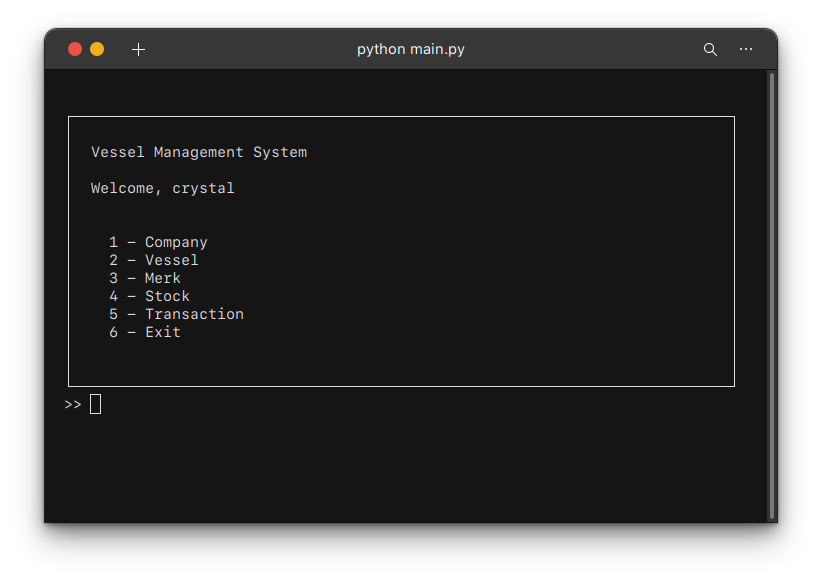
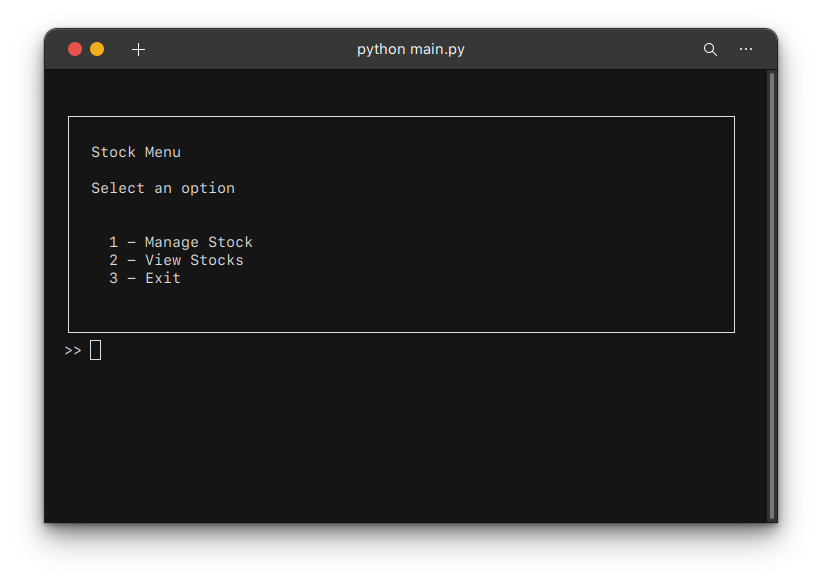
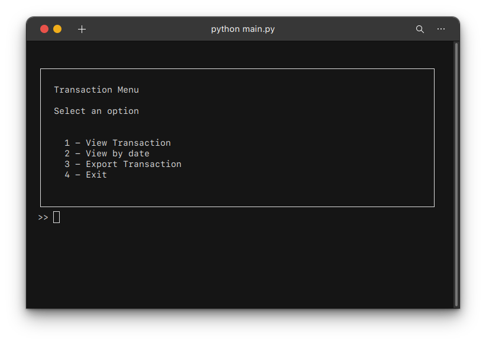
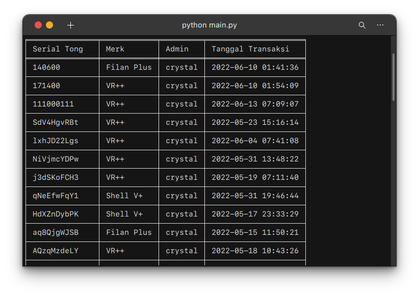

# Vessel Fuel Stock System
An information system used for recording the fuel stock of vessels.

## Requirements
- Linux only
- Python 3.10
- MySQL 

## Installation
1. Clone the repository
2. Enter the directory
3. Install Python 3.10
4. Install MySQL
5. Install requirements.txt
6. Run `python3 main.py`

## Screenshots

